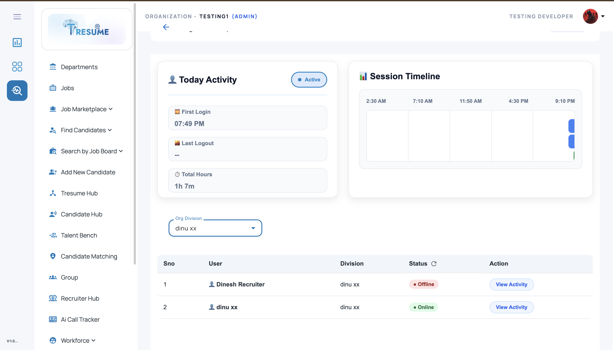
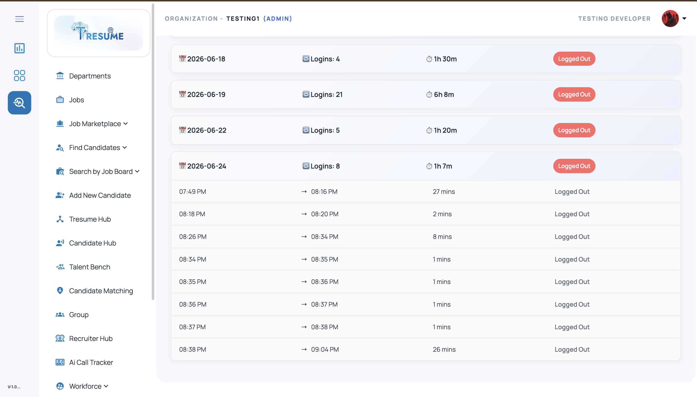

# Login Activity Dashboard

A **login and session activity dashboard** built with **Angular**, **Node.js**, and **Microsoft SQL Server** for tracking user login/logout history, daily sessions, and activity timelines.

This module helps monitor user sessions, visualize daily login activity, and maintain structured login/logout records for internal dashboards, ATS/HRMS systems, admin panels, or employee activity tracking tools.

---

## 🚀 Overview

The **Login Activity Dashboard** is designed to record and display user session activity in a clear and structured way.
It tracks:

* login time
* logout time
* session history
* total active duration
* first login / last logout
* recent session timeline

This project is useful for:

* ATS / HRMS platforms
* internal employee activity dashboards
* admin monitoring panels
* productivity tracking modules
* authentication / session audit features

---

## ✨ Features

## 1) Login / Logout Tracking

Track every user login and logout event with:

* login timestamp
* logout timestamp
* session date
* logout type (manual / browser close / session end)
* multiple sessions per day

---

## 2) Daily Activity Summary

Show daily session insights such as:

* **First Login**
* **Last Logout**
* **Total Hours Worked**
* **Number of Sessions**
* **Most Recent Activity**

---

## 3) Session Timeline Dashboard

Visualize recent sessions using timeline / chart-style blocks:

* session start time
* session end time
* session duration
* last 3 sessions / daily session history
* easy-to-read activity pattern

---

## 4) Dashboard UI Cards

Display user activity inside dashboard cards such as:

* today activity
* session timeline
* login summary
* total active hours
* last session details

---

## 5) Backend Session Logging

Store session data in backend using:

* login event API
* logout event API
* session update logic
* JSON / SQL-based activity storage
* browser close / refresh handling support

---

## 🛠️ Tech Stack

### Frontend

* **Angular**
* **TypeScript**
* **HTML5**
* **SCSS / CSS**
* **Angular Material**

### Backend

* **Node.js**
* **Express.js**

### Database

* **Microsoft SQL Server**

---

## 📂 Project Structure

```bash id="fd7s2m"
login-activity-dashboard/
│
├── frontend/                               # Angular application
│   ├── src/
│   │   ├── app/
│   │   │   ├── components/
│   │   │   │   └── login-activity-dashboard/
│   │   │   ├── services/
│   │   │   ├── models/
│   │   │   └── shared/
│   │   ├── assets/
│   │   └── environments/
│   └── angular.json
│
├── backend/                                # Node.js / Express backend
│   ├── routes/
│   ├── controllers/
│   ├── services/
│   ├── db/
│   ├── config/
│   └── server.js
│
├── database/
│   └── schema.sql
│
├── screenshots/
│   ├── activity-summary-dashboard.png
│   ├── session-timeline.png
│   └── login-activity-view.png
│
└── README.md
```

---

## 🖥️ Core UI Screens

## 1. Today Activity Dashboard

Displays a summary of today’s user activity:

* first login time
* last logout time
* total hours
* active session count

---

## 2. Session Timeline

Shows recent login/logout sessions in timeline / visual block format:

* session start
* session end
* duration
* multiple session bars

---

## 3. Login Activity View

Provides a complete activity screen for session monitoring and daily tracking.

---

## 📸 Screenshots

### Activity Summary Dashboard



### Session Timeline


### Login Activity View



> Create a folder named **`screenshots`** in the repo root and add your screenshots using these names:

* `activity-summary-dashboard.png`
* `session-timeline.png`
* `login-activity-view.png`

---

## 🔄 Typical Workflow

1. User logs into the application
2. Backend records login time
3. Session is added to the activity store for the current day
4. User works inside the platform
5. User logs out / closes browser / session ends
6. Backend updates logout time
7. Dashboard calculates:

   * first login
   * last logout
   * total active hours
   * session duration
8. UI renders session timeline and daily activity summary

---

## 🧪 Example Activity JSON Structure

```json id="b4y9kp"
[
  {
    "date": "2026-06-25",
    "sessions": [
      {
        "loginTime": "09:10 AM",
        "logoutTime": "11:00 AM",
        "logoutType": "USER"
      },
      {
        "loginTime": "02:00 PM",
        "logoutTime": "05:30 PM",
        "logoutType": "AUTO"
      }
    ]
  }
]
```

---

## 🗄️ Example SQL Table Structure

### User Login Activity Table

```sql id="t1m8ra"
CREATE TABLE user_login_activity (
    id INT IDENTITY(1,1) PRIMARY KEY,
    userId INT NOT NULL,
    logDate DATE NOT NULL,
    loginlogout NVARCHAR(MAX),   -- stores JSON session data
    createdAt DATETIME DEFAULT GETDATE(),
    updatedAt DATETIME DEFAULT GETDATE()
);
```

---

## ⚙️ Setup Instructions

## 1) Clone the repository

```bash id="a6j1cn"
git clone https://github.com/YOUR-USERNAME/login-activity-dashboard.git
cd login-activity-dashboard
```

---

## 2) Frontend setup (Angular)

```bash id="q4n8pw"
cd frontend
npm install
ng serve
```

Open in browser:

```bash id="v3k7hf"
http://localhost:4200
```

---

## 3) Backend setup (Node.js)

```bash id="g2x5jd"
cd backend
npm install
npm start
```

---

## 4) Database setup (Microsoft SQL Server)

* Create a SQL Server database
* Run the schema file inside the `database/` folder
* Update SQL connection config in backend

Example config:

```js id="h8r3mf"
const config = {
  user: "your_sql_username",
  password: "your_sql_password",
  server: "localhost",
  database: "LOGIN_ACTIVITY_DB",
  options: {
    trustServerCertificate: true
  }
};
```

---

## 🔌 Example API Endpoints

* `POST /api/login` → record user login
* `POST /api/logout` → record user logout
* `GET /api/activity/:userId` → fetch login activity for a user
* `GET /api/activity/:userId/today` → fetch today’s summary
* `GET /api/activity/:userId/sessions` → fetch session history / timeline

---

## 📊 Example Dashboard Metrics

The dashboard can calculate and display:

* **First Login** → earliest login of the day
* **Last Logout** → latest logout of the day
* **Total Hours** → total time across all completed sessions
* **Session Count** → number of sessions for the day
* **Timeline View** → last few sessions rendered visually

---

## 🧠 Session Handling Notes

This module can support different logout/session end scenarios such as:

* manual logout
* browser/tab close
* session timeout
* refresh-safe login handling
* heartbeat / activity ping support

This makes it useful for real-world admin dashboards and enterprise products.

---

## 📈 Use Cases

This project can be used as a demo / reference implementation for:

* employee login tracking dashboards
* ATS / HRMS user activity monitoring
* admin activity audit tools
* internal session analytics
* attendance / work session visibility systems

---

## 🔒 Important Note

This repository should be published as a **demo / showcase version** only.
Do **not** upload:

* real employee session records
* production authentication secrets
* internal JWT secrets
* database credentials
* private user identifiers
* `.env` files with sensitive values

Use **mock / sanitized session data** for public GitHub uploads.

---

## 🚀 Future Improvements

* weekly / monthly activity reports
* export activity to Excel / PDF
* role-based activity dashboard
* admin overview of all users
* inactivity detection
* login anomaly alerts
* filter by date range
* charts for active hours trend

---

## 👨‍💻 Author

**Dinesh M**
Software Developer | Angular · Node.js · Microsoft SQL Server · ATS / HRMS · AI Automation

* GitHub: https://github.com/Dinesh-T-2005
* LinkedIn: https://www.linkedin.com/in/dinesh-m-a5698b330/
* Email: [dinesh996528@gmail.com](mailto:dinesh996528@gmail.com)

---

## 📄 License

This project is shared for learning, demonstration, and portfolio purposes.
